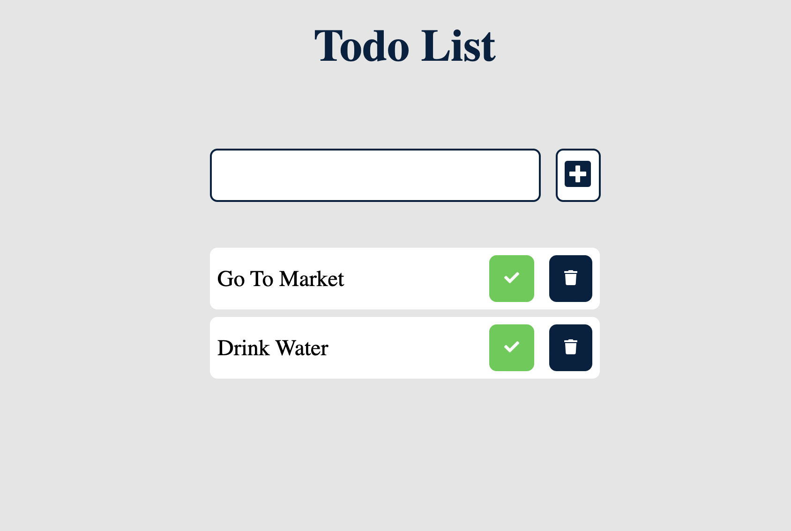

# Todo App

A basic ToDo app that allows you to add, delete and mark items complete.

## How to run

Clone this repository in your Local machine or download the Zip file and then execute the below mentioned steps. Open the index.html file with Live Server or in the browser itself.

### Open app in browser

Once the app is compiled and bundled successfully you should see this screen in your browser. This would be your starting point of the project.

## Instructions

1. It should have a textbox where the user can type in the text for the item, and hit enter or click save to save the item in the list.
2. The list of items should be displayed in a list below the text box
3. The user can delete the item from the list
4. The user can mark the item complete in the list which will show the item, struck off
